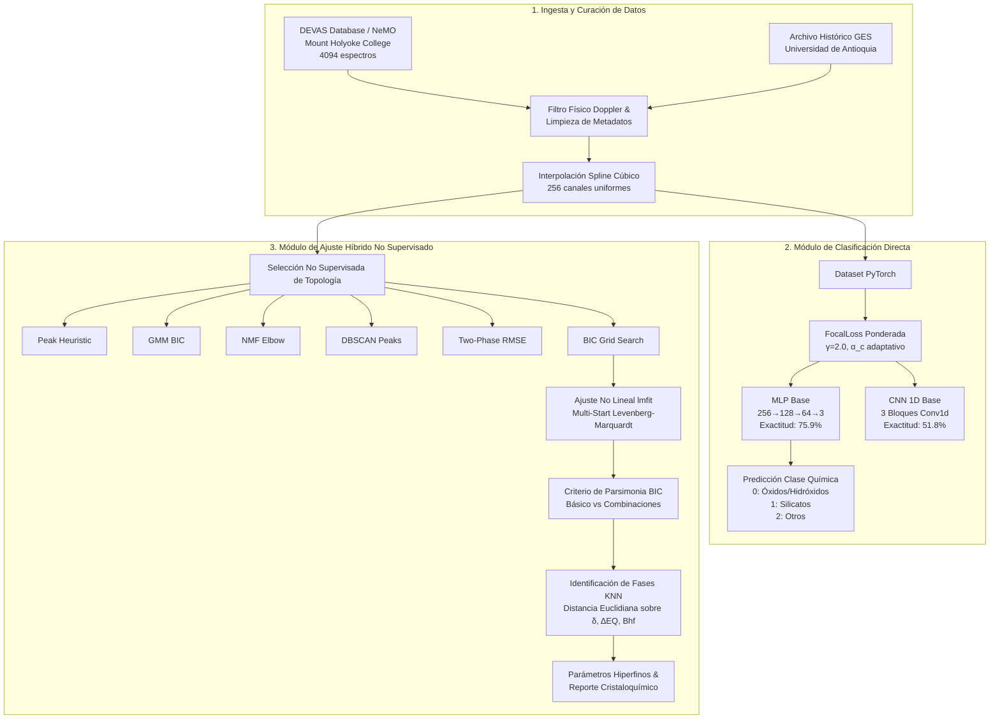

```text
 ███╗   ███╗ ██████╗ ███████╗███████╗ █████╗ ██╗
 ████╗ ████║██╔═══██╗██╔════╝██╔════╝██╔══██╗██║
 ██╔████╔██║██║   ██║███████╗███████╗███████║██║
 ██║╚██╔╝██║██║   ██║╚════██║╚════██║██╔══██║██║
 ██║ ╚═╝ ██║╚██████╔╝███████║███████║██║  ██║██║
 ╚═╝     ╚═╝ ╚═════╝ ╚══════╝╚══════╝╚═╝  ╚═╝╚═╝
```
# MossAI

> **Ajuste espectral híbrido y clasificación de espectros Mössbauer de $^{57}\text{Fe}$ mediante Aprendizaje Automático**

---

[](https://www.python.org/downloads/)
[](https://pytorch.org/)
[](https://lmfit.github.io/lmfit-py/)
[](LICENSE)
[](https://www.udea.edu.co/)

**Autores:**  
- **José David Bernal** ([@JD314](https://github.com/JD314))  
- **Daniel José Duque**  
- **Salomón Urán**  

*Instituto de Física, Facultad de Ciencias Exactas y Naturales, Universidad de Antioquia (UdeA), Medellín, Colombia*  
*15ª Muestra de Física Experimental | Laboratorio Avanzado II (2026)*

---

## 📖 Tabla de Contenidos

1. [Descripción General](#-descripción-general)
2. [Fundamento Físico: Espectroscopía Mössbauer](#-fundamento-físico-espectroscopía-m%C3%B6ssbauer)
   - [Principio de la Técnica](#principio-de-la-técnica)
   - [Video Demostrativo y Explicativo](#video-demostrativo-y-explicativo)
   - [Parámetros Hiperfinos y Topología Espectral](#parámetros-hiperfinos-y-topología-espectral)
3. [Arquitectura del Proyecto y Pipeline](#-arquitectura-del-proyecto-y-pipeline)
   - [Módulo 1: Ingesta, Curación y Preprocesamiento (EDA)](#módulo-1-ingesta-curación-y-preprocesamiento-eda)
   - [Módulo 2: Clasificación Química Directa (MLP vs CNN 1D)](#módulo-2-clasificación-química-directa-mlp-vs-cnn-1d)
   - [Módulo 3: Ajuste Espectral Híbrido No Supervisado (PyMossFit Extendido)](#módulo-3-ajuste-espectral-híbrido-no-supervisado-pymossfit-extendido)
4. [Resultados y Discusión](#-resultados-y-discusión)
   - [Métricas de Clasificación Química](#métricas-de-clasificación-química)
   - [Ajuste y Resolución de Parámetros Hiperfinos](#ajuste-y-resolución-de-parámetros-hiperfinos)
   - [Discusión sobre Acceso a Datos y Registros Experimentales](#discusión-sobre-acceso-a-datos-y-registros-experimentales)
5. [Estructura del Repositorio](#-estructura-del-repositorio)
6. [Instalación y Configuración](#-instalación-y-configuración)
7. [Guía de Uso](#-guía-de-uso)
   - [1. Ejecución de Notebooks Interactivos](#1-ejecución-de-notebooks-interactivos)
   - [2. Benchmark de Ajuste No Supervisado por CLI](#2-benchmark-de-ajuste-no-supervisado-por-cli)
   - [3. Uso Programático como Módulo Python](#3-uso-programático-como-módulo-python)
8. [Trabajo Futuro](#-trabajo-futuro)
9. [Referencias](#-referencias)

---

## 🔬 Descripción General

**MossAI** es un entorno computacional abierto y reproducible para la automatización integral del análisis de espectros de **Espectroscopía Mössbauer de $^{57}\text{Fe}$**.

El procedimiento experimental tradicional en espectroscopía Mössbauer exige que un espectroscopista experto inspeccione visualmente el espectro de absorción, proponga manualmente una hipótesis de modelo físico (número de singletes, dobletes y sextetes), defina cotas y semillas iniciales para los parámetros hiperfinos ($\delta$, $\Delta E_Q$, $B_{hf}$, ancho de línea $\Gamma$) y refine los ajustes mediante mínimos cuadrados no lineales. Este proceso artesanal consume horas o días por lote experimental y depende en gran medida de la experiencia del operador.

**MossAI** resuelve este cuello de botella mediante una metodología en dos etapas complementarias:
1. **Clasificación Química Directa:** Identificación supervisada de familias minerales/químicas a partir de las intensidades del espectro crudo mediante redes neuronales profundas (MLP y CNN 1D) con manejo de desbalance extremo vía `FocalLoss`.
2. **Ajuste Espectral Híbrido No Supervisado:** Selección autónoma de la topología espectral mediante estimadores no supervisados (reglas de picos, GMM, NMF, DBSCAN y exploración penalizada por BIC/RMSE) combinada con optimización no lineal multi-start sobre **PyMossFit** y asignación cristaloquímica post-hoc mediante $k$-Nearest Neighbors (KNN).

```
                        PIPELINE INTEGRAL MOSSAI
 ┌────────────────────────────────────────────────────────────────────────┐
 │                      Datos Espectrales Crudos                          │
 │             (DEVAS / NeMO Open Database + GES UdeA)                    │
 └──────────────────────────────────┬─────────────────────────────────────┘
                                    │
                                    ▼
 ┌────────────────────────────────────────────────────────────────────────┐
 │                      MÓDULO 1: Preprocesamiento                        │
 │    • Filtrado físico Doppler [-12, +12 mm/s]                           │
 │    • Estandarización dimensional por Splines Cúbicos (256/512 pts)     │
 │    • Agrupamiento Cristaloquímico (Óxidos/Hidróxidos, Silicatos, Otros)│
 └──────────────────┬──────────────────────────────────┬──────────────────┘
                    │                                  │
                    ▼                                  ▼
 ┌──────────────────────────────────────┐  ┌──────────────────────────────┐
 │    MÓDULO 2: Clasificación Directa   │  │ MÓDULO 3: Ajuste Híbrido     │
 │  • Entrada: Intensidad Cruda I(v)    │  │ • Selección No Supervisada   │
 │  • MLP Base (Exactitud: 75.9%)       │  │   (Peak, GMM, NMF, DBSCAN,   │
 │  • CNN 1D Base (Exactitud: 51.8%)    │  │    Two-Phase, BIC Grid)      │
 │  • Optimización con Focal Loss       │  │ • Refinamiento lmfit         │
 │  • Salida: Probabilidades de Clase   │  │   (Multi-start Levenberg-M.) │
 └──────────────────────────────────────┘  │ • Parsimonia BIC vs RMSE     │
                                           │ • Mapeo de Fases con KNN     │
                                           │ • Salida: δ, ΔEQ, Bhf, Γ     │
                                           └──────────────────────────────┘
```

---

## ⚛️ Fundamento Físico: Espectroscopía Mössbauer

### Principio de la Técnica

Descubierta por Rudolf Mössbauer en 1958, la espectroscopía Mössbauer se basa en la **emisión y absorción resonante de rayos gamma sin retroceso nuclear** en redes cristalinas sólidas. En núcleos libres o en fases gaseosas/líquidas, la energía del fotón gamma emitido sufre una pérdida por retroceso mecánico del núcleo emisor; sin embargo, en un sólido cristalino a bajas temperaturas o con alta energía de Debye, la masa efectiva que absorbe el retroceso es la de toda la red cristalina, permitiendo líneas de resonancia extremadamente estrechas ($\sim 10^{-8}\text{ eV}$ para el $^{57}\text{Fe}$), con una resolución en energía del orden de $1\text{ parte en }10^{12}$.

Para barrer estas minúsculas diferencias de energía, se modula periódicamente la velocidad $v(t)$ de una fuente radiactiva (típicamente $^{57}\text{Co}$ en matriz de Rh) mediante un **transductor electromecánico Doppler**, generando una modulación de energía:

$$\Delta E = E_\gamma \frac{v}{c}$$

Donde $E_\gamma = 14.41\text{ keV}$ para la transición nuclear de $^{57}\text{Fe}$, $v$ es la velocidad relativa en $\text{mm/s}$ y $c$ es la velocidad de la luz.

### Video Demostrativo y Explicativo

Para profundizar en el montaje experimental, la interacción radiación-materia y la fenomenología del efecto Mössbauer, se recomienda revisar el siguiente recurso audiovisual:

[](https://www.youtube.com/watch?v=v1TSYnFJP-c)

> 📺 **Ver Video:** [Mössbauer Spectroscopy - Overview of Technique & Principles](https://www.youtube.com/watch?v=v1TSYnFJP-c)

---

### Parámetros Hiperfinos y Topología Espectral

Las interacciones entre el núcleo sonda $^{57}\text{Fe}$ y los campos electromagnéticos locales creados por su entorno electrónico determinan los tres parámetros hiperfinos fundamentales:

| Parámetro Hiperfino | Origen Físico | Manifestación Espectral | Topología Asociada |
| :--- | :--- | :--- | :---: |
| **Corrimiento Isomérico ($\delta$)** | Interacción culombiana electrostática monopolar entre la densidad de carga de electrones $s$ en el núcleo $|\psi(0)|^2$ y el radio nuclear. Sensible al **estado de oxidación** ($\text{Fe}^{2+}, \text{Fe}^{3+}$) y número de coordinación. | Desplazamiento global del centroide respecto al patrón ($\alpha\text{-Fe}$). | **Singlete (1S)** |
| **Desdoblamiento Cuadrupolar ($\Delta E_Q$)** | Interacción entre el momento cuadrupolar nuclear $eQ$ del estado excitado ($I=3/2$) y el **gradiente de campo eléctrico (EFG)** generado por asimetrías en la red o en los orbitales de valencia. | División del nivel excitado en dos subniveles ($m_I = \pm 3/2$ y $\pm 1/2$), originando dos picos de absorción simétricos. | **Doblete (1D, 2D)** |
| **Campo Hiperfino Magnético ($B_{hf}$)** | Interacción dipolar magnética nuclear (Efecto Zeeman nuclear) producida por electrones desapareados en materiales con **orden magnético** (ferro-, ferri- o antiferromagnéticos). | Desdoblamiento de los niveles en 6 transiciones dipolares permitidas ($\Delta m_I = 0, \pm 1$) con intensidades relativas $3:2:1:1:2:3$. | **Sextete (1X, 2X)** |

#### Modelado Matemático de Subespectros

Cada línea de absorción se formula mediante un perfil Lorentziano normalizado:

$$L(v; A, v_0, \Gamma) = - A \frac{(\Gamma/2)^2}{(v - v_0)^2 + (\Gamma/2)^2}$$

- **Singlete:** $S(v) = L(v; A_s, \delta, \Gamma_s)$
- **Doblete:** $D(v) = L\left(v; \frac{A_d}{2}, \delta - \frac{\Delta E_Q}{2}, \Gamma_d\right) + L\left(v; \frac{A_d}{2}, \delta + \frac{\Delta E_Q}{2}, \Gamma_d\right)$
- **Sextete:** $X(v) = \sum_{k=1}^{6} L(v; A_x \cdot I_k, \delta + p_k B_{hf}, \Gamma_x)$, con posiciones relativas $p_k \in \{-1, -0.6+\varepsilon, -0.2, +0.2, +0.6-\varepsilon, +1\}$ e intensidades $I_k \in \{3, 2, 1, 1, 2, 3\}/12$.

---

## 🏗️ Arquitectura del Proyecto y Pipeline



---

### Módulo 1: Ingesta, Curación y Preprocesamiento (EDA)

Implementado en `Data/joint_dataset.py` y `EDA_.ipynb`:
- **Deserialización Segura:** Parser sintáctico robusto que resuelve comas anidadas en nombres de muestras y orígenes cristaloquímicos.
- **Filtro Físico Doppler:** Remoción de espectros con canales de velocidad espurios fuera del rango operativo de modulación $[-12.0, +12.0]\text{ mm/s}$.
- **Homogeneización Dimensional:** Muestreo y estandarización a $N=256$ canales espaciados uniformemente mediante splines cúbicos sobre la grilla de velocidad.
- **Mapeo Cristaloquímico:** Agrupamiento de decenas de subfamilias minerales en 3 macro-clases funcionales:
  - **Clase 0 (Óxidos e Hidróxidos):** Hematita, Magnetita, Goethita, Ilmenita, etc.
  - **Clase 1 (Silicatos mayoritarios):** Piroxeno, Olivino, Anfíbol.
  - **Clase 2 (Otros):** Sulfatos, Fosfatos, Metales, Haluros, Filosilicatos complejos, Carbonatos, Sulfuros, Turmalinas, etc.

---

### Módulo 2: Clasificación Química Directa (MLP vs CNN 1D)

Implementado en `src/mossbauer_models.py` y `02_direct_classification.ipynb`:

#### Arquitecturas Evaluadas

1. **MLP Base (Multilayer Perceptron):**
   ```
   Entrada (B, 1, 256) ──► AdaptiveAvgPool1d(256) ──► Flatten
     ──► Linear(256, 128) ──► ReLU ──► Dropout(0.3)
     ──► Linear(128, 64)  ──► ReLU ──► Dropout(0.3)
     ──► Linear(64, 3)    ──► Logits
   ```
2. **CNN 1D Base (Convolutional Neural Network):**
   ```
   Entrada (B, 1, 256)
     ──► Conv1d(1→32, k=7, p=3)   ──► BatchNorm1d ──► ReLU ──► MaxPool1d(2)
     ──► Conv1d(32→64, k=5, p=2)  ──► BatchNorm1d ──► ReLU ──► MaxPool1d(2)
     ──► Conv1d(64→128, k=3, p=1) ──► BatchNorm1d ──► ReLU ──► MaxPool1d(2)
     ──► AdaptiveAvgPool1d(1) ──► Flatten ──► Linear(128, 64) ──► ReLU ──► Linear(64, 3)
   ```

#### Mitigación del Desbalance con Focal Loss

Para contrarrestar el desbalance natural de la base de datos (donde Silicatos y Óxidos superan ampliamente a las clases minoritarias), se implementa la función de pérdida `FocalLoss` (`src/focal_loss.py`):

$$\mathcal{L}_{\text{Focal}} = -\alpha_t (1 - p_t)^\gamma \log(p_t)$$

Con parámetro focal $\gamma = 2.0$ y pesos de clase calculados dinámicamente en cada fold como $\alpha_c \propto 1 / N_c$.

---

### Módulo 3: Ajuste Espectral Híbrido No Supervisado (PyMossFit Extendido)

Implementado en `PyMossfit/pymossfit.py` y `src/fit_dataset.py`:

El módulo no supervisado determina automáticamente el vector de topología $(n_s, n_d, n_x)$ evaluando seis estrategias de selección de modelo:
1. **`peak_heuristic`:** Estimación basada en conteo de mínimos locales, prominencia y anchos de línea.
2. **`gmm`:** Agrupamiento de mezclas gaussianas ponderadas por la curva de absorción, optimizando el número de componentes por BIC.
3. **`nmf`:** Descomposición matricial no negativa con detección de punto de quiebre (codo) en el residuo de reconstrucción.
4. **`dbscan_peaks`:** Agrupamiento espacial por densidad para asociar picos aislados (singletes), pares simétricos (dobletes) o sextetos.
5. **`two_phase`:** Ajuste secuencial de topologías fundamentales con optimización multi-start y selección por mínimo $\text{RMSE}$.
6. **`bic_grid`:** Exploración exhaustiva de topologías parsimoniosas penalizadas por el Criterio de Información Bayesiano ($\text{BIC}$):

$$\text{BIC} = N \ln\left(\frac{\text{SSR}}{N}\right) + k \ln(N)$$

#### Refinamiento y Mapeo Cristaloquímico (KNN)

- **Optimización no lineal:** Minimización de residuales con `lmfit` (algoritmo Levenberg-Marquardt) y múltiples inicios aleatorios (*multi-start*) para evadir mínimos locales.
- **Identificación de Fases:** Búsqueda del vecino más cercano en la base `PyMossfit/reference_data.csv` evaluando la distancia euclidiana normalizada en el espacio de parámetros $(\delta, \Delta E_Q, B_{hf})$.

---

## 📊 Resultados y Discusión

### Métricas de Clasificación Química

Resultados obtenidos tras validación cruzada estratificada de 5 particiones (*5-Fold Stratified CV*) sobre 4094 espectros:

| Arquitectura | Exactitud Promedio | Macro-F1 | F1 Ponderado |
| :--- | :---: | :---: | :---: |
| **CNN 1D Base** | $0.518 \pm 0.134$ | $0.461 \pm 0.136$ | $0.465 \pm 0.156$ |
| **MLP Base** | $\mathbf{0.759 \pm 0.015}$ | $\mathbf{0.745 \pm 0.021}$ | $\mathbf{0.750 \pm 0.020}$ |

```
                       DESEMPEÑO DE CLASIFICACIÓN (5-FOLD CV)
    ┌───────────────────────────────────────────────────────────────────┐
    │ MLP Base    [███████████████████████████████████░░░░░] 75.9% ± 1.5% │
    │ CNN 1D Base [███████████████████████░░░░░░░░░░░░░░░░░] 51.8% ± 13.4%│
    └───────────────────────────────────────────────────────────────────┘
```

#### Análisis de la Superioridad del MLP frente a CNN 1D

1. **Representación Global vs. Filtros Locales:** El MLP procesa holísticamente la envolvente espectral, capturando de forma inmediata el número global y separación de las depresiones de absorción. Por el contrario, la CNN 1D requiere un volumen de datos mucho mayor para aprender filtros convolucionales invariantes desde cero.
2. **Robustez ante el Desbalance y Heterogeneidad:** La matriz de confusión demuestra que el MLP logra un **86% de acierto en la clase minoritaria Otros**, mientras que la CNN colapsa al 53%, confundiéndola frecuentemente con Silicatos debido a la alta varianza morfológica intra-clase.

---

### Ajuste y Resolución de Parámetros Hiperfinos

El esquema híbrido no supervisado sobre PyMossFit demostró convergencia robusta tanto en espectros con alta relación señal/ruido (SNR) como en espectros altamente ruidosos:

- **Espectro A (Señal Limpia, Dobletes Resueltos):** Detección autónoma de topología $(n_s=0, n_d=2, n_x=0)$, ajustando con alta precisión los centros $\delta$, desdoblamientos $\Delta E_Q$ y anchos de línea $\Gamma$.
- **Espectro B (Alto Ruido Experimental):** Convergencia autónoma a topología $(n_s=0, n_d=1, n_x=0)$, donde la penalización BIC descartó la adición espuria de sextetes inducidos por ruido aleatorio.

---

### Discusión sobre Acceso a Datos y Registros Experimentales

- **Bases de Datos Abiertas vs. Privativas:** A nivel internacional, los repositorios Mössbauer más exhaustivos son propietarios o de pago por suscripción. La base DEVAS/NeMO del Mount Holyoke College constituye uno de los pocos esfuerzos de ciencia abierta en este ámbito.
- **Archivo Histórico GES (UdeA):** Se examinaron registros históricos del Grupo de Estado Sólido de la Universidad de Antioquia. La curación masiva se vio limitada por disparidad de formatos multicanal, ausencia de metadatos cristaloquímicos, espectros no calibrados a velocidad física ($\text{mm/s}$) y la indisponibilidad de fuentes radiactivas para recalibración durante el desarrollo del trabajo. MossAI sienta las bases metodológicas para digitalizar e integrar sistemáticamente este archivo histórico.

---

## 📁 Estructura del Repositorio

```bash
MossAI/
├── Data/                               # Módulos de datos y metadatos
│   ├── joint_dataset.py                # Parser relacional y unificación de espectros
│   ├── metadata.csv                    # Metadatos cristaloquímicos (DEVAS/NeMO)
│   ├── spectra.csv                     # Canales espectrales crudos
│   └── data.csv                        # Dataset estructurado combinado
├── PyMossfit/                          # Extensión no supervisada de PyMossFit
│   ├── __init__.py
│   ├── pymossfit.py                    # Algoritmos de ajuste, topologías y KNN
│   ├── evaluate_unsupervised.py        # Script CLI de benchmarking no supervisado
│   ├── reference_data.csv              # Base de parámetros hiperfinos de referencia
│   ├── Calib-Fe.csv                    # Espectro estándar de calibración (α-Fe)
│   ├── Calib-Fe.txt                    # Datos crudos de calibración
│   └── PyMossFit_User_s_Manual.pdf     # Manual de usuario original de PyMossFit
├── src/                                # Módulos de Machine Learning y utilidades
│   ├── mossbauer_models.py             # Arquitecturas MLP/CNN y funciones analíticas
│   ├── focal_loss.py                   # Implementación de FocalLoss con balance α
│   ├── collate_fn.py                   # Padding dinámico para batches de PyTorch
│   ├── fit_dataset.py                  # Serialización de ajustes duales en Parquet
│   └── metrics.py                      # Matrices de confusión, curvas ROC y calibración
├── outputs/                            # Artefactos generados por el pipeline
│   ├── mossbauer_processed.parquet     # Dataset preprocesado normalizado (256 pts)
│   ├── eda/                            # Figuras de análisis exploratorio
│   ├── models/                         # Checkpoints entrenados (*.pt por fold)
│   └── results/                        # Métricas en JSON y gráficos de desempeño
├── EDA_.ipynb                          # Notebook: Módulo 1 (EDA & Preprocesamiento)
├── 02_direct_classification.ipynb      # Notebook: Módulo 2 (Clasificación Directa)
├── 3_fit.ipynb                         # Notebook: Módulo 3 (Ajuste Espectral Híbrido)
├── run_pipeline.py                     # Script orquestador de ejecución secuencial
├── requirements.txt                    # Dependencias del proyecto
├── Informe.pdf                         # Artículo técnico del proyecto
└── Poster.pdf                          # Póster de la 15ª Muestra de Física Exp.
```

---

## ⚙️ Instalación y Configuración

### 1. Clonar el Repositorio

```bash
git clone https://github.com/JD314/MossAI.git
cd MossAI
```

### 2. Crear Entorno Virtual

Se recomienda Python 3.10 o superior:

```bash
python3 -m venv venv
source venv/bin/activate  # En Linux/macOS
# .\venv\Scripts\activate   # En Windows
```

### 3. Instalar Dependencias

```bash
pip install --upgrade pip
pip install -r requirements.txt
```

---

## 🚀 Guía de Uso

### 1. Ejecución de Notebooks Interactivos

Los módulos se encuentran secuenciados en cuadernos de Jupyter:
- **`EDA_.ipynb`:** Ejecuta la limpieza de metadatos, filtro físico Doppler, interpolación por splines y genera `outputs/mossbauer_processed.parquet`.
- **`02_direct_classification.ipynb`:** Realiza el entrenamiento de MLP y CNN 1D mediante 5-fold cross-validation y almacena métricas y gráficos en `outputs/results/`.
- **`3_fit.ipynb`:** Ejecuta el ajuste espectral híbrido no supervisado, evalúa parsimonia BIC y asigna fases mediante KNN.

### 2. Benchmark de Ajuste No Supervisado por CLI

Puede ejecutarse el evaluador de ajuste sobre el espectro de calibración o sobre muestras aleatorias del dataset:

```bash
python3 PyMossfit/evaluate_unsupervised.py --calib PyMossfit/Calib-Fe.csv --n-samples 5 --n-starts 6
```

### 3. Uso Programático como Módulo Python

Es posible utilizar las funciones de ajuste de **MossAI** directamente en scripts propios:

```python
import numpy as np
from PyMossfit.pymossfit import fit_spectrum, identify_phases, load_calibrated_csv

# Cargar espectro calibrado
velocity, intensity = load_calibrated_csv("PyMossfit/Calib-Fe.csv")

# Ajuste automático con selección por BIC
resultado = fit_spectrum(velocity, intensity, method="bic_grid", n_random_starts=6)

print(f"Topología detectada (Singletes, Dobletes, Sextetes): {resultado.topology.as_tuple()}")
print(f"Error RMSE del ajuste: {resultado.rmse:.6f}")
print(f"Criterio de Información Bayesiano (BIC): {resultado.bic:.2f}")

# Identificación de fases candidatas por KNN
fases = identify_phases(resultado.report_rows)
for idx, f in enumerate(fases, 1):
    top_match = f["matches"][0]
    print(f"Componente {idx}: {top_match['compound']} ({top_match['formula']}) - Confianza: {top_match['distance']:.4f}")
```

---

## 🔮 Trabajo Futuro

1. **Preentrenamiento con Datos Sintéticos:** Generar espectros sintéticos mediante combinaciones teóricas de Lorentzianas para preentrenar representaciones profundas antes de realizar fine-tuning sobre datos experimentales escasos.
2. **Ciclo Semi-Supervisado Cerrado:** Emplear las pseudo-etiquetas topológicas generadas por el Módulo 3 para entrenar un clasificador discriminativo rápido de topologías espectrales.
3. **Digitalización del Archivo Histórico UdeA:** Completar la estandarización y calibración Doppler de los archivos históricos del Grupo de Estado Sólido para su inclusión en la base de datos abierta.

---

## 📚 Referencias

```text
[1] D. Henao, J. Lopez, J. Tobon, and C. Barrero, "Implementation of an artificial neural network in the identification of the Mössbauer spectral shape of hematite and magnetite," Hyperfine Interactions, vol. 244, no. 11, 2023. https://doi.org/10.1007/s10751-023-01821-w

[2] C. Carey, T. Boucher, S. Mahadevan, P. Bartholomew, and M. D. Dyar, "Machine learning tools for mineral recognition and classification from Raman spectroscopy," Journal of Raman Spectroscopy, vol. 46, no. 10, pp. 894–903, 2015. https://doi.org/10.1002/jrs.4757

[3] J. Liu, M. Osadchy, L. Ashton, M. Foster, C. J. Solomon, and S. J. Gibson, "One-Dimensional Deep Convolutional Neural Network for Mineral Classification from Raman Spectroscopy," Neural Processing Letters, 2021. https://doi.org/10.1007/s11063-021-10652-1

[4] R. L. Mössbauer, "Kernresonanzfluoreszenz von Gammastrahlung in Ir191," Zeitschrift für Physik, vol. 151, pp. 124–143, 1958.

[5] N. N. Greenwood and T. C. Gibb, Mössbauer Spectroscopy. London: Chapman and Hall, 1971.

[6] P. Gütlich, E. Bill, and A. X. Trautwein, Mössbauer Spectroscopy and Transition Metal Chemistry: Fundamentals and Applications. Berlin/Heidelberg: Springer, 2011. https://doi.org/10.1007/978-3-540-88428-6

[7] M. D. Dyar, "Mössbauer dataset," DEVAS Database, Mount Holyoke College, 2022. http://nemo.mtholyoke.edu/explorer?ds_kind=Mossbauer&ds_name=MHC%20Mossbauer

[8] F. D. Saccone, "PyMossFit: A Google Colab Option for Mössbauer Spectra Fitting," Spectroscopy Journal, vol. 3, no. 4, p. 29, 2025. https://doi.org/10.3390/spectroscj3040029
```

---

<div align="center">
<sub>Documentación técnica generada y optimizada con <b>Antigravity CLI (AGY CLI)</b></sub>
</div>
